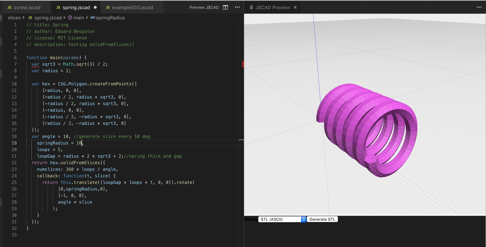

# vscode-jscad-editor

This extension provides a JSCAD preview panel for *.jscad files in Visual Studio Code, (theoretically) allowing to create 3D-printable objects using Javascript.

> WARNING: this is a prototype that was created on one afternoon! It really just provides the basic preview functionality for JSCAD objects.

## Features

This prototype is the result of a bored afternoon, after I got my new 3D printer but still had to wait for the PLA to be delivered. First I discovered [OpenSCAD](http://openscad.org) and then stumbled upon [OpenJSCAD.org](http://openjscad.org), which I think are both totally exciting for any programmer with a design background and a 3D printer :) ..

Being a bit underwhelmed by existing editing solutions available for both, I decided to connect VSCode and JSCAD, while at the same time getting my hands dirty with extension development for VSCode. This is what came out. Yay!

This screenshot shows the editor on the left and the interactive JSCAD preview on the right. Changing anything in the code causes immediate updates in the preview. (Well .. Yes, maybe I should make a screencast ;) .. but believe me, it's awesome)

## Usage

For the time being (while this is not published to the marketplace) - clone this repository, cd into it, install dependencies, compile and open VSCode:

    cd vscode-jscad-editor
    npm install
    npm run compile
    code .

In VSCode press `F5` to start an editor session with the extension loaded. Then open a `*.jscad` file, e.g. from the included `examples` directory and see what happens (a few examples don't work)

## Known Issues

- export/save not working (needs more investigation)
- JSCAD web editor is currently highly incompatible with my chosen approach of using a postMessage API to trigger any kind of actions inside the preview .. (might look into JSCAD.org if I find the time)
- JSCAD editor height adjustment not working smoothly
- high chance of memory leaks because nothing is properly cleaned or disposed yet

## Release Notes

### 0.0.1

Initial prototype

