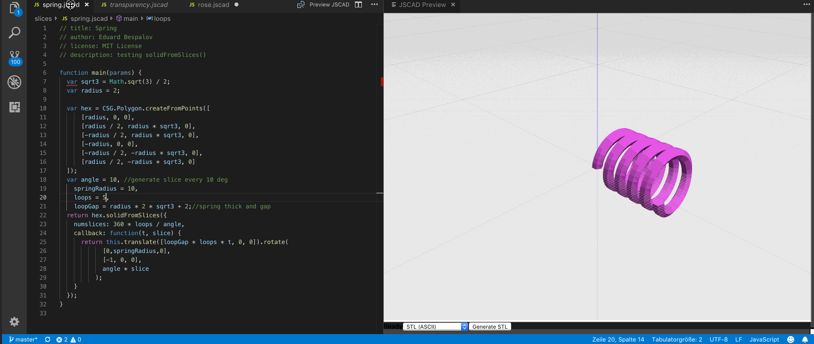

# vscode-jscad

This extension provides a JSCAD preview panel for *.jscad files in Visual Studio Code, (theoretically) allowing to create 3D-printable objects using Javascript.

> NOTE: this is still a very early version with only basic viewer functionality and STL export. However I personally use it to create 3d prints so I guess you could, too.

## History

The original prototype was the result of a bored afternoon, after I got my new 3D printer but still had to wait for the PLA to be delivered. First I discovered [OpenSCAD](http://openscad.org) and then stumbled upon [OpenJSCAD.org](http://openjscad.org), which I think are both totally exciting for any programmer with a design background and a 3D printer :) ..

Being a bit underwhelmed by existing editing solutions available for both, I decided to connect VSCode and JSCAD, while at the same time getting my hands dirty with extension development for VSCode. This is what came out. Yay!

This screencast shows the editor on the left and the interactive JSCAD preview on the right. Changing anything in the code causes immediate updates in the preview.

## Installation

For the time being (while this is not published to the marketplace) I recommend installation as VSIX file using [vsce](https://code.visualstudio.com/api/working-with-extensions/publishing-extension) (the official VS Code extension management tool) with the following steps:

Install vsce

    npm install -g vsce

Download vscode-jscad

    git clone https://github.com/ryx/vscode-jscad.git
    cd vscode-jscad

Fetch dependencies

    npm install

Build VSIX package (will output a file `vscode-jscad-{VERSION}.vsix` for the current version)

    vsce package

Install the extension in Visual Studio Code via commandline (replace version)

    code --install-extension vscode-jscad-{VERSION}.vsix

## Usage

Open a `*.jscad` file, e.g. from the included `examples` directory and open a split editor pane. Then press <Shift+Cmd+V> (on Mac) or <Shift+Ctrl+V> on other platforms to open the viewer.

## Known Issues

- JSCAD viewer is still the default "viewer-options.html" from jscad web build; should create a custom build and use the Processor directly instead, using a real application build
- view presets (top/left/front/...) are a bit stupid and often too close or too far away; should calculate the optimal view distance instead
- high chance of memory leaks because some things are not properly cleaned or disposed yet

## Release Notes

### 0.0.3

Fixes some bugs

### 0.0.2

Now with improved viewer panel, JSCAD > STL export command, statusbar output and basic error messages.

### 0.0.1

Initial prototype
